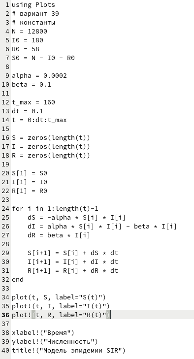

---
## Author
author:
  name: Люпп Софья Романовна
  degrees: Bachelor's
  orcid: 0000-0002-0877-7063
  email: 1132236039@rudn.ru
  affiliation:
    - name: Российский университет дружбы народов
      country: Российская Федерация
      postal-code: 117198
      city: Москва
      address: ул. Миклухо-Маклая, д. 6
## Title
title: Лабораторная работа №6
subtitle: Задача об эпидемии
license: CC BY
date: today
date-format: "YYYY-MM-DD" # Example: 2025-09-06
---

# Информация

## Докладчик

:::::::::::::: {.columns align=center}
::: {.column width="70%"}

  * Люпп Софья Романовна
  * студентка НКНбд-01-23
  * кафедра теории вероятностей и кибербезопасности
  * Российский университет дружбы народов им. П. Лумумбы
  * 1132236039@rudn.ru
  * <https://github.com/srluipp>

:::
::: {.column width="30%"}

:::
::::::::::::::

# Вводная часть

## Актуальность

Модель SIR (Susceptible‑Infected‑Recovered) остаётся одним из фундаментальных инструментов в эпидемиологии, позволяя оценивать динамику распространения инфекций в популяциях.

## Объект и предмет исследования

Обьект исследования: Модель SIR
Предмет исследования: Задача об эпидемии

## Цели 

Рассмотреть задачу об эпидемии и изучить модель SIR

## Задачи

1) Построить графики изменения числа особей в каждой из трех групп;

2) Рассмотреть, как будет протекать эпидемия в двух случаях.

## Материалы и методы

Лабораторная работа №6 по математическому моделированию

# Создание презентации

## Описание модели

В соответствии со своим заданием выписываю константы и пишу код для описания модели SIR для задачи об эпидемии ([рис. @fig-001]).

{#fig-001 width=70%}

## Получившийся график

Делаю производные форматы при момощи Julia tangle.jl, открываю ноутбук файл jupyter notebook и вывожу результиющий график ([рис. @fig-002]).

{#fig-002 width=70%}

## Результаты

В ходе лабораторной работы я изучила модели SIR и задачу об эпидемии, смоделировала SIR

## Итоговый слайд

{#fig-003 width=70%}

:::
