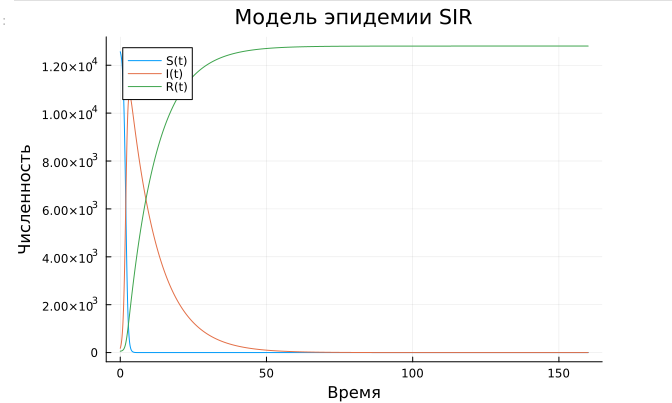

---
## Author
author:
  name: Люпп Софья Романовна
  degrees: Bachelor's
  orcid: 0000-0002-0877-7063
  email: 1132236039@rudn.ru
  affiliation:
    - name: Российский университет дружбы народов
      country: Российская Федерация
      postal-code: 117198
      city: Москва
      address: ул. Миклухо-Маклая, д. 6

## Title
title: "Лабораторная работа №6"
subtitle: "Задача об эпидемии"
license: "CC BY"
---

# Цель работы

Рассмотреть задачу об эпидемии и изучить модель SIR

# Задание

На одном острове вспыхнула эпидемия. Известно, что из всех проживающих
на острове (N=12 800) в момент начала эпидемии (t=0) число заболевших людей
(являющихся распространителями инфекции) I(0)=180, А число здоровых людей с
иммунитетом к болезни R(0)=58. Таким образом, число людей восприимчивых к
болезни, но пока здоровых, в начальный момент времени S(0)=N-I(0)- R(0).

Построить графики изменения числа особей в каждой из трех групп.
Рассмотреть, как будет протекать эпидемия в двух случаях.

# Теоретическое введение

Рассмотрим простейшую модель эпидемии. Предположим, что некая
популяция, состоящая из N особей, (считаем, что популяция изолирована)
подразделяется на три группы. Первая группа - это восприимчивые к болезни, но
пока здоровые особи, обозначим их через S(t). Вторая группа – это число
инфицированных особей, которые также при этом являются распространителями
инфекции, обозначим их I(t). А третья группа, обозначающаяся через R(t) – это
здоровые особи с иммунитетом к болезни.
До того, как число заболевших не превышает критического значения I, считаем, что все больные изолированы и не заражают здоровых. Когда I(t),тогда инфицирование способны заражать восприимчивых к болезни особей.

# Выполнение лабораторной работы

В соответствии со своим заданием выписываю константы и пишу код для описания модели SIR для задачи об эпидемии ([рис. @fig-001]).

{#fig-001 width=70%}

Делаю производные форматы при момощи Julia tangle.jl, открываю ноутбук файл jupyter notebook и вывожу результиющий график ([рис. @fig-002]).

{#fig-002 width=70%}

# Выводы

В ходе лабораторной работы я изучила модели SIR и задачу об эпидемии

# Список литературы{.unnumbered}

- Математическое моделирование. Лабораторная работа №6

::: {#refs}
:::
