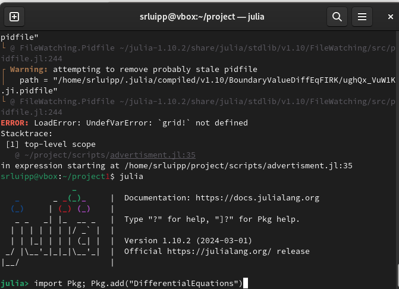
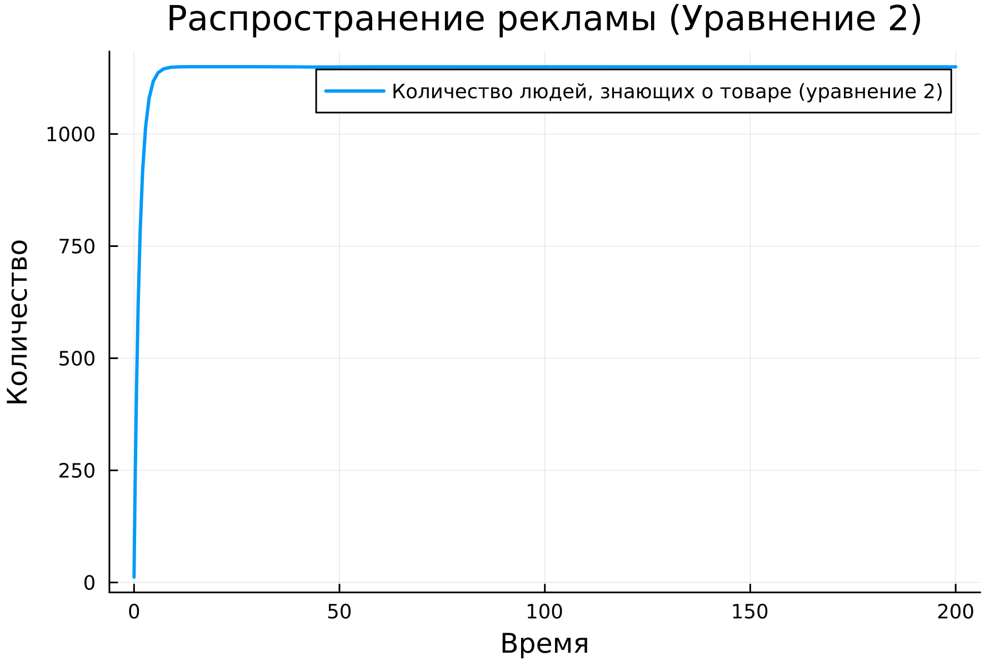

---
## Author
author:
  name: Люпп Софья Романовна
  degrees: Bachelor's
  orcid: 0000-0002-0877-7063
  email: 1132236039@rudn.ru
  affiliation:
    - name: Российский университет дружбы народов
      country: Российская Федерация
      postal-code: 117198
      city: Москва
      address: ул. Миклухо-Маклая, д. 6

## Title
title: "Лабораторная работа №7"
subtitle: "Задача о распространение рекламы"
license: "CC BY"
---

# Цель работы

Рассмотреть задачу о распространении рекламы, изучить и построить модель 

# Задание

Построить график распространения рекламы. При этом объем аудитории N=1150, в начальный момент о товаре знает 12 человек. Для случая 2 определите в какой момент времени скорость распространения рекламы будет иметь максимальное значение.

# Теоретическое введение

Модель рекламной кампании описывается следующими величинами.
Считаем, что dn\dt - скорость изменения со временем числа потребителей, узнавших о товаре и готовых его купить, t - время, прошедшее с начала рекламной кампании, nt( ) - число уже информированных клиентов. Эта величина пропорциональна числу покупателей, еще не знающих о нем, это описывается следующим образом, где N - общее число потенциальных платежеспособных покупателей, характеризует интенсивность рекламной кампании (зависит от затрат на рекламу в данный момент времени).

Помимо этого, узнавшие о товаре потребители также распространяют полученную информацию среди потенциальных покупателей, не знающих о нем (в этом случае работает т.н. сарафанное радио). Этот вклад в рекламу описывается величиной, которая увеличивается с увеличением потребителей узнавших о товаре.

# Выполнение лабораторной работы

В соответствии со своим заданием выписываю константы и пишу код для описания модели о распространении рекламы ([рис. @fig-001]).

{#fig-001 width=70%}

Добавляю через Julia необходимые пакеты с решениями дифференциальных уравнений ([рис. @fig-002]).

{#fig-002 width=70%}

Делаю производные форматы при момощи Julia tangle.jl, открываю ноутбук файл jupyter notebook и вывожу результиющий график ([рис. @fig-003]).

{#fig-003 width=70%}

В консоль вывелись максимальная скорость распространения рекламы, которая достигается в момент времени t=0 ([рис. @fig-004]).

{#fig-004 width=70%}

# Выводы

В ходе лабораторной работы я изучила модель о распространении рекламы

# Список литературы{.unnumbered}

- Математическое моделирование. Лабораторная работа №7

::: {#refs}
:::
