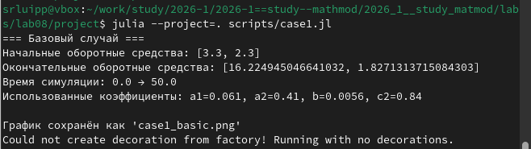
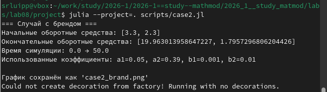
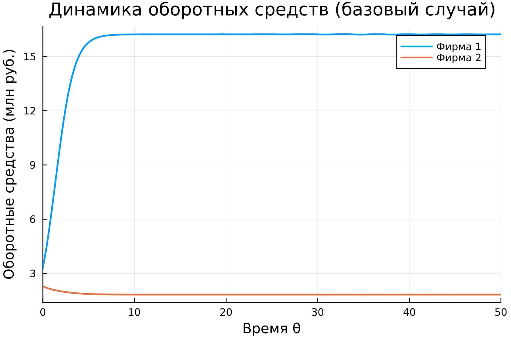
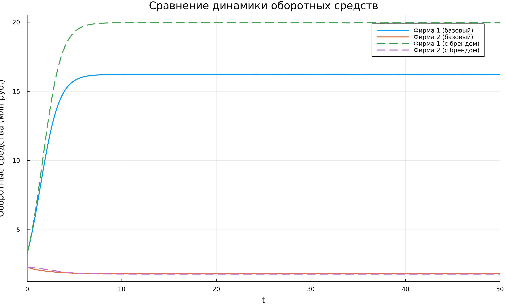

---
## Author
author:
  name: Люпп Софья Романовна
  degrees: Bachelor's
  orcid: 0000-0002-0877-7063
  email: 1132236039@rudn.ru
  affiliation:
    - name: Российский университет дружбы народов
      country: Российская Федерация
      postal-code: 117198
      city: Москва
      address: ул. Миклухо-Маклая, д. 6
## Title
title: Лабораторная работа №8
subtitle: Модель конкуренции двух фирм
license: CC BY
date: today
date-format: "YYYY-MM-DD" # Example: 2025-09-06
---

# Информация

## Докладчик

:::::::::::::: {.columns align=center}
::: {.column width="70%"}

  * Люпп Софья Романовна
  * студентка НКНбд-01-23
  * кафедра теории вероятностей и кибербезопасности
  * Российский университет дружбы народов им. П. Лумумбы
  * 1132236039@rudn.ru
  * <https://github.com/srluipp>

:::
::: {.column width="30%"}

:::
::::::::::::::

# Вводная часть

## Актуальность

В современном мире с капиталистическим строем конкуренция является весомой составляющей получения прибыли для компаний. Знание о планах, изменений оборота и других факторах конкурента поможет лучше анализировать свой бизнес и принимать правильные решения с целью получения большей прибыли

## Объект и предмет исследования

Обьект исследования: Две конкурирующие фирмы
Предмет исследования: Модель конкуренции двух фирм

## Цели 

Рассмотреть и изучить модель концуренции двух фирм

## Задачи

1. Построить графики изменения оборотных средств фирмы 1 и фирмы 2 без учета постоянных издержек и с введенной нормировкой для случая 1
2. Построить графики изменения оборотных средств фирмы 1 и фирмы 2 без учета постоянных издержек и с введенной нормировкой для случая 2

## Материалы и методы

Лабораторная работа №8 по математическому моделированию

# Создание презентации

## Описание модели

## Вывод об изменении оборотных средств фирмы 1 и 2

Изменение оборотных средств фирмы 1 и фирмы 2 без учета постоянных издержек и с введенной нормировкой ([рис. @fig-001]). 

{#fig-001 width=70%}

## График изменения оборотных средств фирмы 1 и 2 

Вывожу график изменения оборотных средств фирмы 1 и фирмы 2 без учета постоянных издержек и с введенной нормировкой ([рис. @fig-002]).

{#fig-002 width=70%}

## Вывод изменения оборота с учетом социальных факторов

Помимо экономического фактора влияния (изменение себестоимости, производственного цикла, использование кредита и т.п.), используются еще и социально-психологические факторы. Вывожу в косоль выводы об обороте фирм в этом случае и вывожу график изменения ([рис. @fig-003]) .

{#fig-003 width=70%}

## График изменения оборота фирм с учетом социальных факторов

([рис. @fig-004]).
{#fig-004 width=70%}

## Сравнение случаев 1 и 2

Делаю график для сравнения для случаев 1 и 2 ([рис. @fig-005]).

{#fig-005 width=70%}

## Результаты

В ходе лабораторной работы я изучила модель конкуренции двух фирм

## Итоговый слайд

{#fig-006 width=70%}

:::
