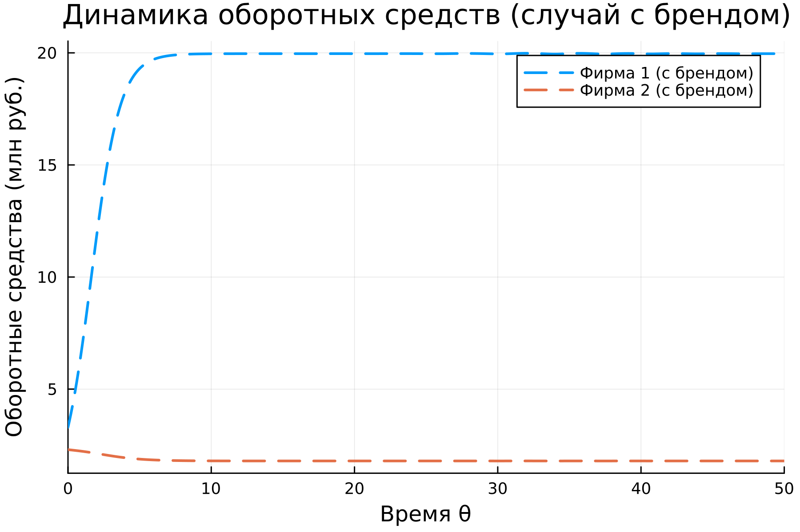

---
## Author
author:
  name: Люпп Софья Романовна
  degrees: Bachelor's
  orcid: 0000-0002-0877-7063
  email: 1132236039@rudn.ru
  affiliation:
    - name: Российский университет дружбы народов
      country: Российская Федерация
      postal-code: 117198
      city: Москва
      address: ул. Миклухо-Маклая, д. 6

## Title
title: "Лабораторная работа №8"
subtitle: "Модель конкуренции двух фирм"
license: "CC BY"
---

# Цель работы

Рассмотреть модель конкуренции двух фирм, изучить и построить модель 

# Задание

1. Построить графики изменения оборотных средств фирмы 1 и фирмы 2 без учета постоянных издержек и с введенной нормировкой для случая 1
2. Построить графики изменения оборотных средств фирмы 1 и фирмы 2 без учета постоянных издержек и с введенной нормировкой для случая 2

# Теоретическое введение

Для построения модели конкуренции хотя бы двух фирм необходимо рассмотреть модель одной фирмы. Вначале рассмотрим модель фирмы, производящей продукт долговременного пользования, когда цена его определяется
балансом спроса и предложения. Примем, что этот продукт занимает определенную нишу рынка и конкуренты в ней отсутствуют.

Обозначим:
N – число потребителей производимого продукта.
S – доходы потребителей данного продукта. Считаем, что доходы всех
потребителей одинаковы. Это предположение справедливо, если речь идет об
одной рыночной нише, т.е. производимый продукт ориентирован на определенный
слой населения.
M – оборотные средства предприятия
τ – длительность производственного цикла
p – рыночная цена товара
p̃ – себестоимость продукта, то есть переменные издержки на производство
единицы продукции.
δ – доля оборотных средств, идущая на покрытие переменных издержек.
κ – постоянные издержки, которые не зависят от количества выпускаемой
продукции.
Q(S/p) – функция спроса, зависящая от отношения дохода S к цене p. Она
равна количеству продукта, потребляемого одним потребителем в единицу
времени.

# Выполнение лабораторной работы

В соответствии со своим заданием варианта 39 выписываю константы и начальные условия для задачи конкуренции двух фирм и пишу код для описания случая 1: график изменения оборотных средств фирмы 1 и фирмы 2 без учета постоянных издержек и с введенной нормировкой. Вывожу вывод об обороте фирм в консоль и вывожу график изменения ([рис. @fig-001]) ([рис. @fig-002]).

{#fig-001 width=70%}

{#fig-002 width=70%}

Далее в соответствии с заданием для случая 2, когда, помимо экономического фактора влияния (изменение себестоимости, производственного цикла, использование кредита и т.п.), используются еще и социально-психологические факторы. Вывожу в косоль выводы об обороте фирм в этом случае и вывожу график изменения ([рис. @fig-003]) ([рис. @fig-004]).

{#fig-003 width=70%}

{#fig-004 width=70%}

Делаю график для сравнения для случаев 1 и 2 ([рис. @fig-005]).

{#fig-005 width=70%}

# Выводы

В ходе лабораторной работы я изучила модель двух конкурирующих фирм

# Список литературы{.unnumbered}

- Математическое моделирование. Лабораторная работа №8

::: {#refs}
:::
