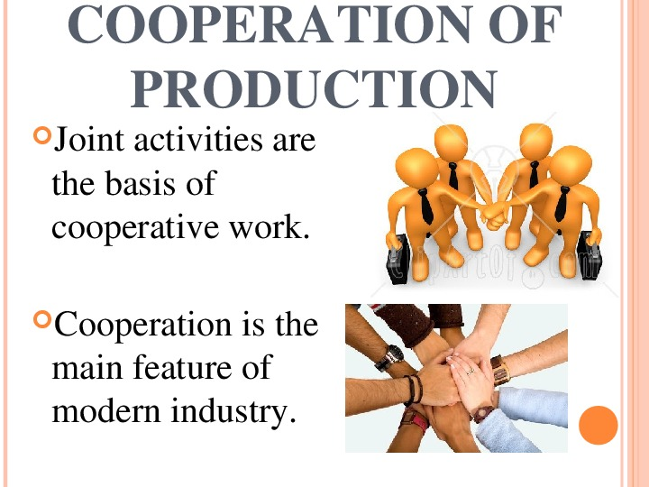

---
## Author
author:
  name: Люпп Софья Романовна
  degrees: BSc
  orcid: 0000-0002-0877-7063
  email: 1132236039@rudn.ru
  affiliation:
    - name: Российский университет дружбы народов
      country: Российская Федерация
      postal-code: 117198
      city: Москва
      address: ул. Миклухо-Маклая, д. 6
## Title
title: Доклад по математическому моделированию
subtitle: Игра чистой кооперации
license: CC BY
date: today
date-format: "YYYY-MM-DD" # Example: 2025-09-06
---

# Информация

## Докладчик

:::::::::::::: {.columns align=center}
::: {.column width="70%"}

  * Люпп Софья Романовна
  * студентка группы НКНбд-01-23
  * кафедра теории вероятностей и кибербезопасности
  * Российский университет дружбы народов им. П. Лумумбы
  * [1132236039@rudn.ru]
  * <https://github.com/srluipp>

:::
::: {.column width="30%"}

:::
::::::::::::::

# Вводная часть

## Актуальность

Игры чистой кооперации играют ключевую роль в понимании механизмов устойчивого сотрудничества в условиях, когда выигрыш всех участников максимален только при согласованных действиях. Они находят применение в экономике, экологии, транспорте и технологиях, например, при согласовании дорожных правил, заключении международных экологических договоров или установлении единых технологических стандартов (USB, Wi-Fi). 

## Объект и предмет исследования

Объект исследования: кооперативные взаимодействия в теории игр.

Предмет: математические модели игр чистой кооперации.

## Цели и задачи

Цель: изучить математическую модель игры чистой кооперации. 

Задачи: определить признаки чистой кооперации, рассмотреть ключевые типы игр, изучить принцип распределения выигрыша — вектор Шепли.

## Материалы 

Материалы: классические модели теории игр (Нэш, Шепли), ключевые типы игр чистой кооперации. 

## Суть чистой кооперации

Игры чистой кооперации (pure cooperative games) — класс игр в теории игр, в которых игроки могут заключать обязательные соглашения, совместно выбирать стратегии и делить выигрыш по заранее согласованным правилам, когда именно кооперация и выбор той же стратегии, что и стратегия соперника, приведет обоих к наилучшим результатам ([рис. @fig-001]).

{#fig-001 width=70%}

## Математическая модель

Имеется два игрока. У каждого две стратегии — C и F. Если оба игрока выбирают стратегию C, то они получают выигрыш (a, a), где при a = 1 игра является игрой чистой кооперации, а при a > 1 — особенной разновидностью такой игры. Если оба игрока выбирают стратегию F, то они получают (1, 1). Если стратегии игроков различны, то они не получают ничего. Равновесиями Нэша в данной игре являются пары (C, C) и (F, F) ([рис. @fig-002]).

{#fig-002 width=70%}

## Задача автомобилистов

Если оба выполнят один и тот же манёвр с отклонением, им удастся обогнать друг друга, но если они выберут разные манёвры, они столкнутся. На рис. 3 ([рис. @fig-003]) успешное прохождение представлено выигрышем 8, а столкновением - выигрышем 0. 

{#fig-003 width=70%}

## Охота на оленей

Игра «охотой на оленей» (рис. 4) ([рис. @fig-004])представляет собой следующий сценарий. Два охотника могут выбрать: охотиться на оленя вместе (что обеспечивает наиболее экономически эффективный результат) или охотиться на кролика в одиночку. Если два охотника не будут сотрудничать, шансы на успех минимальны.

{#fig-004 width=70%}

## Выгода при кооперациях

Иногда усовершенствования при кооперациях противоречат друг другу, что делает некоторые координационные игры особенно сложными и интересными (например, охота на оленей, в которой состояние {Stag,Stag} имеет более высокие доходы, но зато состояние {Hare,Hare} безопаснее).

## Борьба полов

В типе игры борьба полов или координация конфликтующих интересов (рис. 5) ([рис. @fig-005]) оба игрока предпочитают заниматься одним и тем же занятием, а не идти в одиночку, но их истинные предпочтения обоих различаются. 

{#fig-005 width=70%}

## Итоговый слайд

В социальных науках игра чистой кооперации является типичным решением проблемы координации. Выбор кооперации, как правило, является стабильным в ситуациях, когда все стороны могут реализовать взаимные выгоды, но только путем принятия взаимно последовательных решений.

::: incremental

:::
