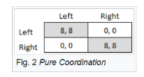
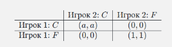
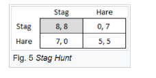

---
## Author
author:
  name: Люпп Софья Романовна
  degrees: DSc
  orcid: 0000-0002-0877-7063
  email: 1132236039@rudn.ru
  affiliation:
    - name: Российский университет дружбы народов
      country: Российская Федерация
      postal-code: 117198
      city: Москва
      address: ул. Миклухо-Маклая, д. 6

## Title
title: "Доклад по математическому моделированию"
subtitle: "Игры чистой кооперации"
license: "CC BY"
---

# Цель работы

Изучить, что такое игра чистой кооперации

# Задание

1) Изучить математическую модель игры чистой кооперации

# Теоретическое введение

## Суть чистой кооперации

Игры чистой кооперации (pure cooperative games) — это класс игр в теории игр, в которых игроки могут заключать обязательные соглашения, совместно выбирать стратегии и делить выигрыш по заранее согласованным правилам. Суть в том, что именно кооперация и выбор той же стратегии, что и стратегия соперника, приведет обоих к наилучшим результатам. В отличие от некооперативных игр, где игроки действуют независимо, в кооперативных играх ключевым является формирование коалиций и справедливое распределение совместного выигрыша.

Такие игры являются формализацией проблемы кооперации, которая широко распространена в социальных науках, в том числе в экономике, — то есть в ситуациях, в которых все стороны смогут реализовать взаимную прибыль, но только путём взаимно согласованных решений.

## Главный принцип

Имеется два игрока. У каждого две стратегии — C и F. Если оба игрока выбирают стратегию C, то они получают выигрыш (a, a), где при a = 1 игра является игрой чистой кооперации, а при a > 1 — особенной разновидностью такой игры. Если оба игрока выбирают стратегию F, то они получают (1, 1). Если стратегии игроков различны, то они не получают ничего. Равновесиями Нэша в данной игре являются пары (C, C) и (F, F).

## Пример 1 - автомобилисты 

Типичным примером для координационной игры является выбор сторон дороги, по которой следует ехать автомобилистам. Предположим, что два водителя встречаются на узкой грунтовой дороге. Оба должны свернуть, чтобы избежать столкновения с целью наступления противостояния. Если оба выполнят один и тот же манёвр с отклонением, им удастся обогнать друг друга, но если они выберут разные манёвры, они столкнутся. На рис. 1 ([рис. @fig-001]) успешное прохождение представлено выигрышем 8, а столкновением - выигрышем 0. В этом случае существуют два чистых равновесия Нэша: либо оба смещаются влево, либо оба смещаются вправо. В этом примере не имеет значения, какую сторону выбирают оба игрока, если они выбирают одну и ту же. Эта игра называется чистой координационной игрой. 

{#fig-001 width=70%}

## Assurance game

Игра с гарантиями описывает ситуацию, когда ни один игрок не может предложить достаточную сумму, если он вносит свой вклад в одиночку; таким образом, игрок 1 должен отказаться от игры, если у игрока 2 нет достаточного количества ресурсов. Однако, если игрок 2 решает внести свой вклад, то и игрок 1 должен тоже внести свой вклад.

Эту игру еще называют «охотой на оленей» (рис. 2) ([рис. @fig-002]), которая представляет следующий сценарий. Два охотника могут выбрать: охотиться на оленя вместе (что обеспечивает наиболее экономически эффективный результат) или охотиться на кролика в одиночку. Если два охотника не будут сотрудничать, шансы на успех минимальны. Таким образом, сценарий, в котором оба охотника выбирают координацию, обеспечит наиболее выгодный результат для общества. Общая проблема, связанная с охотой на оленей, - это количество доверия, необходимое для достижения этого результата.

{#fig-002 width=70%}

Многие авторы предположили, что определённые равновесия являются фокусными по той или иной причине. Например, некоторые равновесия могут давать более высокую прибыль, быть более заметными или быть более безопасными. Иногда эти усовершенствования противоречат друг другу, что делает некоторые координационные игры особенно сложными и интересными (например, охота на оленей, в которой состояние {Stag,Stag} имеет более высокие доходы, но зато состояние {Hare,Hare} безопаснее).

## Борьба полов

Другой тип координационной игры называют борьбой полов или координацией конфликтующих интересов (рис. 3) ([рис. @fig-003]). В этой игре оба игрока предпочитают заниматься одним и тем же занятием, а не идти в одиночку, но их истинные предпочтения различаются. Предположим, что пара спорит о том, что делать на выходных. Оба знают, что они извлекуют больше выгоды для отношений, проведя выходные вместе, однако мужчина предпочитает смотреть футбольный матч, а женщина предпочитает ходить по магазинам.

Поскольку пара хочет проводить время вместе, они не получат никакой пользы, занимаясь отдельным занятием. Если они идут за покупками или играют в футбол, то один человек извлекает определённую пользу из того, что он находится с другим человеком, но не извлекает полезность из самой деятельности. В отличие от других форм координационных игр, описанных ранее, знание стратегии противника не поможет вам принять решение о вашем курсе действий. Из-за этого существует вероятность, что равновесие не будет достигнуто. 

{#fig-003 width=70%}

## Вектор Шелли 

Вектор Шепли используют как принцип оптимальности распределения выигрыша между игроками в задачах теории кооперативных игр. Представляет собой распределение, в котором выигрыш каждого игрока равен его среднему вкладу в благосостояние тотальной коалиции при определенном механизме её формирования.

Для кооперативной игры рассмотрим некоторое упорядочение множества игроков N. Обозначим через K_i подмножество, содержащее i первых игроков в данном упорядочении. Вкладом i-го по счету игрока назовем величину v(K_i) - v(K_{i-1}), где v — характеристическая функция кооперативной игры.

Пусть N = {1, 2, ..., n} — множество игроков.
Пусть π = (π_1, π_2, ..., π_n) — некоторое упорядочение (перестановка) игроков.
Обозначим K_i^π = {π_1, π_2, ..., π_i} — коалиция первых i игроков в этом порядке.
При этом K_0^π = ∅.

Вклад игрока π_i в упорядочении π определяется как:
Δ_i^π = v(K_i^π) - v(K_{i-1}^π)

Это предельный вклад игрока π_i при присоединении к коалиции, сформированной всеми предыдущими игроками.

Сумма вкладов по всем игрокам в одном упорядочении равна:
sum_{i=1}^n Δ_i^π = v(K_n^π) - v(K_0^π) = v(N) - v(∅) = v(N)

Вектор Шепли — это среднее значение вклада игрока i по всем возможным упорядочениям π ∈ Π(N):
φ_i(v) = (1/n!) * sum_{π ∈ Π(N)} [v(K_i^π) - v(K_{i-1}^π)] ([рис. @fig-004]).

где K_i^π — коалиция первых i игроков в порядке π, и π_i = i.

{#fig-004 width=70%}

# Выводы

В социальных науках игра чистой кооперации является типичным решением проблемы координации. Выбор кооперации, как правило, является стабильным в ситуациях, когда все стороны могут реализовать взаимные выгоды, но только путем принятия взаимно последовательных решений.

# Список литературы{.unnumbered}

\cite{coordination_game_en}, 
\cite{shapley_vector_ru}

::: {#refs}
:::
