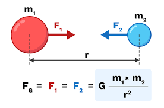
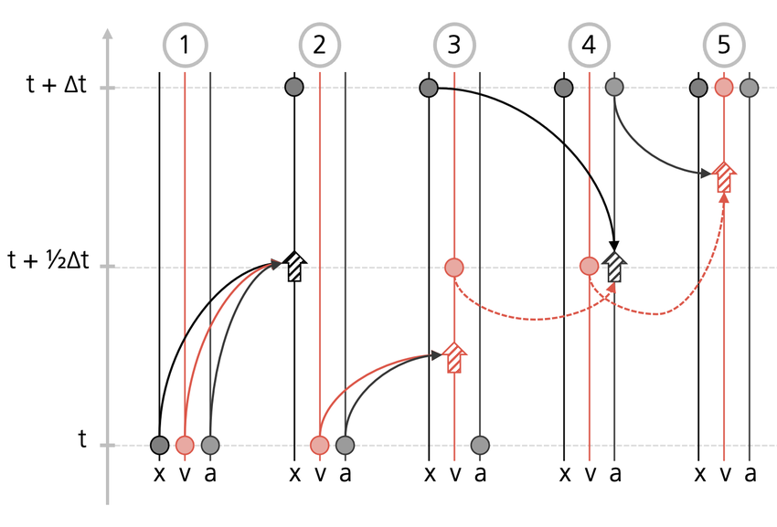
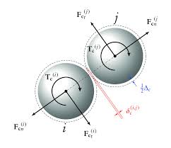

---
## Author
author:
  - name: Арбатова Варвара Петровна
    degrees: BSc
    orcid: 0000-0002-0877-7063
    email: 1132236020@rudn.ru
    affiliation:
      name: Российский университет дружбы народов
      country: Российская Федерация
      postal-code: 117198
      city: Москва
      address: ул. Оржоникидзе, 3
  - name: Карпова Есения Алексеевна
    degrees: BSc
    email: 1132236008@rudn.ru
    affiliation:
      name: Российский университет дружбы народов
      country: Российская Федерация
      postal-code: 117198
      city: Москва
      address: ул. Оржоникидзе, 3
  - name: Дагделен Зейнап Реджеповна
    degrees: BSc
    email: 1132236052@rudn.ru
    affiliation:
      name: Российский университет дружбы народов
      country: Российская Федерация
      postal-code: 117198
      city: Москва
      address: ул. Оржоникидзе, 3
  - name: Бюгданюк Анна Васильевна
    degrees: BSc
    email: 1132236023@rudn.ru
    affiliation:
      name: Российский университет дружбы народов
      country: Российская Федерация
      postal-code: 117198
      city: Москва
      address: ул. Оржоникидзе, 3
  - name: Люпп Софья Романовна
    degrees: BSc
    email: 1132236039@rudn.ru
    affiliation:
      name: Российский университет дружбы народов
      country: Российская Федерация
      postal-code: 117198
      city: Москва
      address: ул. Оржоникидзе, 3
## Title
title: "Проектная работа. Образование планетной системы"
subtitle: "Второй этап"
license: CC BY
date: today
date-format: "YYYY-MM-DD" # Example: 2025-09-06
---

# Цель работы

Целью данного этапа работы является разработка алгоритмов численного моделирования образования планетной системы из газопылевого облака, включая алгоритмы вычисления гравитационных сил, сил отталкивания и трения, интегрирования уравнений движения, обновления угловых скоростей и слипания частиц, на основе которых будет реализована программа моделирования.

# Структуры данных

Каждая частица описывается набором параметров: масса $m_i$, радиус $R_i$, координаты $\mathbf{r}_i$, скорость $\mathbf{v}_i$, угловая скорость $\omega_i$ и флаг активности (нужен для обработки слипания). Все частицы хранятся в массиве фиксированной длины $N$.

{#fig-001 width=70%}

# Инициализация

$$
r = r_0\sqrt{\xi_1}, \quad \alpha = 2\pi\,\xi_2
$$

$$
v_x = -y\,\omega_0\left(\frac{r_0}{r}\right)^{3/2}, \quad v_y = x\,\omega_0\left(\frac{r_0}{r}\right)^{3/2}, \quad v_z = 0
$$

$$
\mathbf{v}_i \leftarrow \mathbf{v}_i - \frac{\sum_j m_j \mathbf{v}_j}{\sum_j m_j}
$$

# Главный цикл

## Шаг 1. Вычисление сил

{#fig-001 width=50%}

$$
\mathbf{F}^g_{ij} = -\frac{\gamma m_i m_j}{b^3}\,\mathbf{b}_{ij}
$$

$$
\mathbf{F}^r_{ij} = k\left(\left(\frac{R_i+R_j}{b}\right)^8 - 1\right)\frac{\mathbf{b}_{ij}}{b}
$$

$$
W_\perp = (\mathbf{W} \cdot \mathbf{n}_{ij}) - \omega_i R_i - \omega_j R_j
$$

$$
\mathbf{F}^f_{ij} = \beta\,W_\perp\,F^r(b)\,\mathbf{n}_{ij}
$$

## Шаг 2. Интегрирование уравнений движения

{#fig-001 width=50%}
$$
\mathbf{r}_i \leftarrow \mathbf{r}_i + \mathbf{v}_i\,\Delta t + \frac{\mathbf{F}_i}{2m_i}\,\Delta t^2
$$

$$
\mathbf{v}_i \leftarrow \mathbf{v}_i + \frac{\mathbf{F}_i^{\,\text{old}} + \mathbf{F}_i^{\,\text{new}}}{2m_i}\,\Delta t
$$

## Шаг 3. Обновление угловых скоростей

{#fig-001 width=50%}

$$
\varepsilon_i = \frac{1}{I_i}\sum_{j} \frac{b_{ij}}{R_i + R_j} F^f_{ij}, \quad I_i = \frac{2}{5}m_i R_i^2
$$

$$
\omega_i \leftarrow \omega_i + \varepsilon_i\,\Delta t
$$

## Шаг 4. Проверка условия слипания

Перебираются все активные пары $(i, j)$. Если $b_{ij} < \delta$ (пороговое расстояние), частицы объединяются: вычисляются параметры новой частицы с сохранением массы и импульса:

$$
m \leftarrow m_i + m_j, \quad R \leftarrow \sqrt[3]{R_i^3 + R_j^3}
$$

$$
\mathbf{r} \leftarrow \frac{m_i\mathbf{r}_i + m_j\mathbf{r}_j}{m}, \quad \mathbf{v} \leftarrow \frac{m_i\mathbf{v}_i + m_j\mathbf{v}_j}{m}
$$

Результат записывается на место частицы $i$, частица $j$ помечается как неактивная. Общее число активных частиц уменьшается на единицу.

## Шаг 5. Вычисление и запись энергий

$$
E_k = \sum_i \frac{m_i v_i^2}{2} + \sum_i \frac{I_i \omega_i^2}{2}, \quad U = -\frac{1}{2}\sum_{i \neq j} \frac{\gamma m_i m_j}{b_{ij}}
$$

$$
E = E_k + U, \quad Q(t) = E(0) - E(t)
$$

# Блок-схемы

{#fig-001 width=70%}

# Вывод

На данном этапе были разработаны алгоритмы численного моделирования: инициализация системы частиц, вычисление гравитационных сил, сил отталкивания и трения, интегрирование уравнений движения методом Верле, обновление угловых скоростей, слипание частиц с сохранением массы и импульса, а также вычисление энергий системы. Полученные алгоритмы служат основой для программной реализации на следующем этапе.

::: {#refs}
:::
